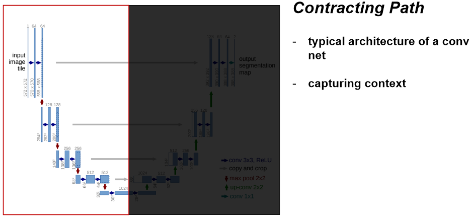
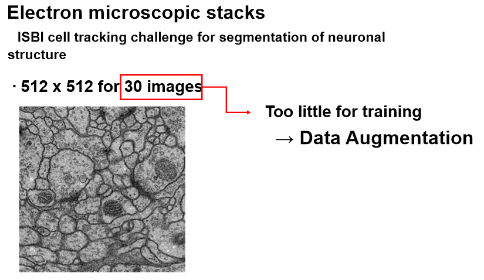

# U-Net : Convolutional Networks for Biomedical Image Segmentation

### _Olaf Ronneberger, Philipp Fischer, and Thomas Brox_

Conference on CVPR 2015

***

## Purpose

The strategy in [Ciresan et al.](https://proceedings.neurips.cc/paper/2012/file/459a4ddcb586f24efd9395aa7662bc7c-Paper.pdf) has two drawbacks

* Quite slow
* Trade-off between localization accuracy and the use of context  

Thus,

1. To resolve above drawbacks
2. To improve segmentation quality of ISBI cell tracking challenge's image  

## Contribution

1. Advance from Fully Convolutional Networks (FCN)
2. Large Image (High resolution) $\to$ Overlap-Tite Input
3. Little training Data $\to$ Data Augmentation  
   
   ## Methodology
   
   

***

  

***

  

***

  

***

  

***

  

***

  

## Experiments

  

***

  

## Summary

  

## References

* [tistory blog from @msmapark2](https://medium.com/@msmapark2/u-net-%EB%85%BC%EB%AC%B8-%EB%A6%AC%EB%B7%B0-u-net-convolutional-networks-for-biomedical-image-segmentation-456d6901b28a)  
* [U-Net : Convolutional Networks for Biomedical Image Segmentation](https://arxiv.org/abs/1505.04597)
